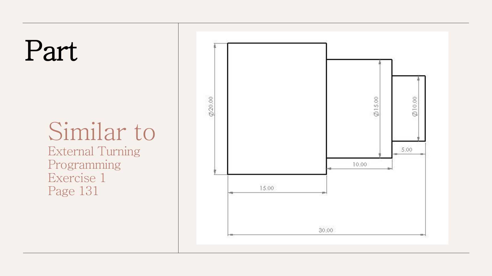
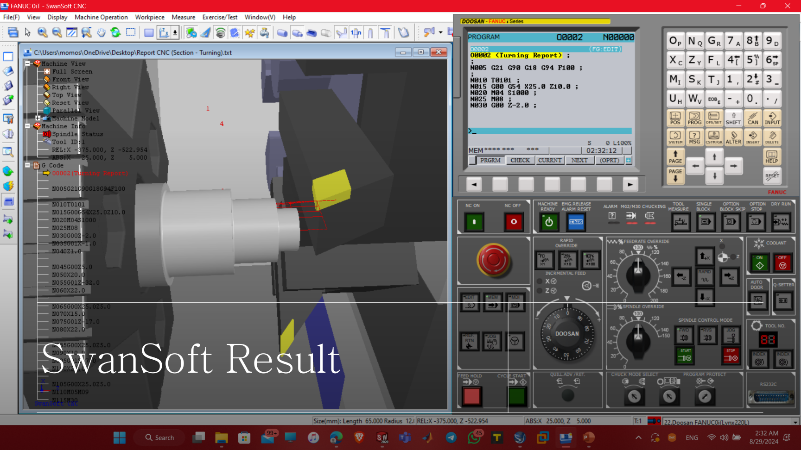
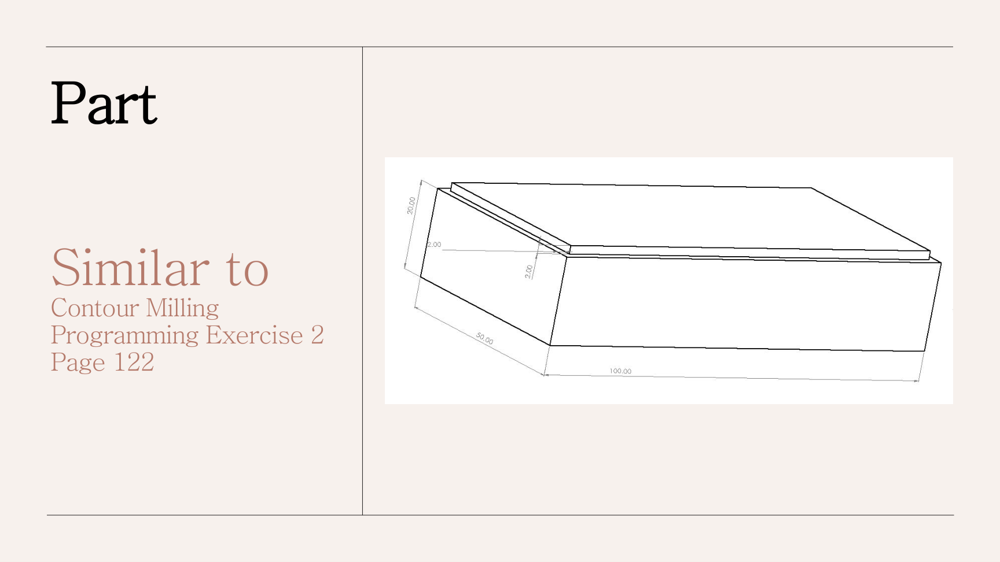
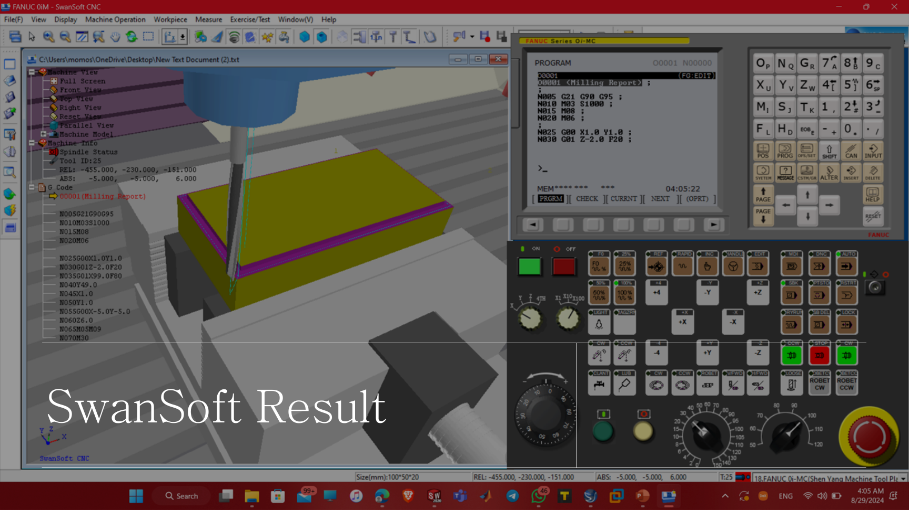
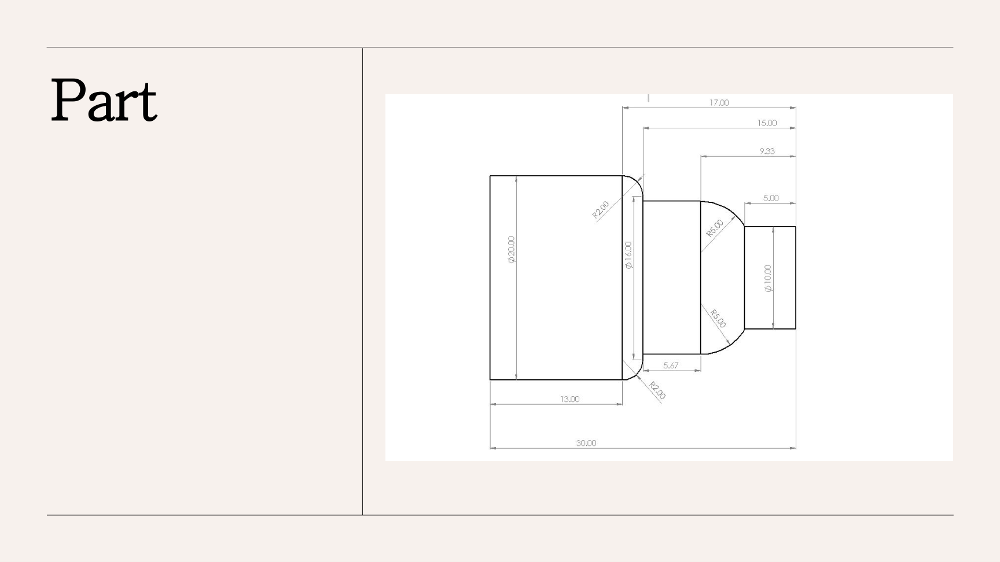
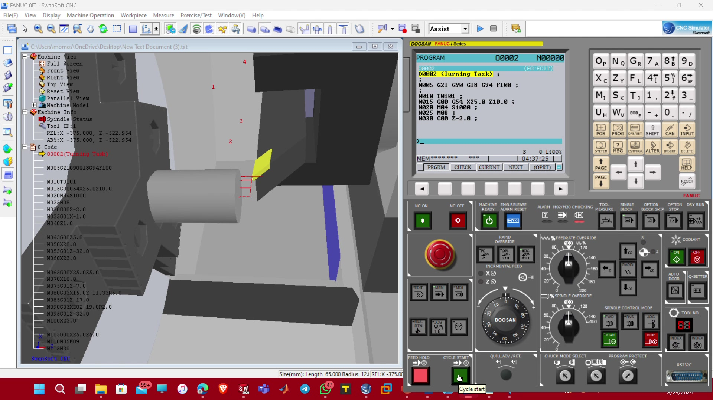
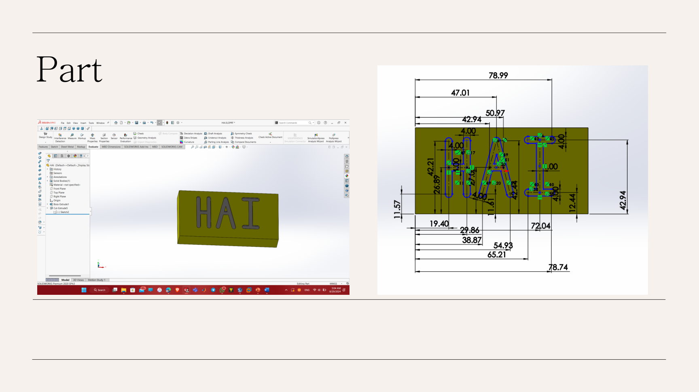
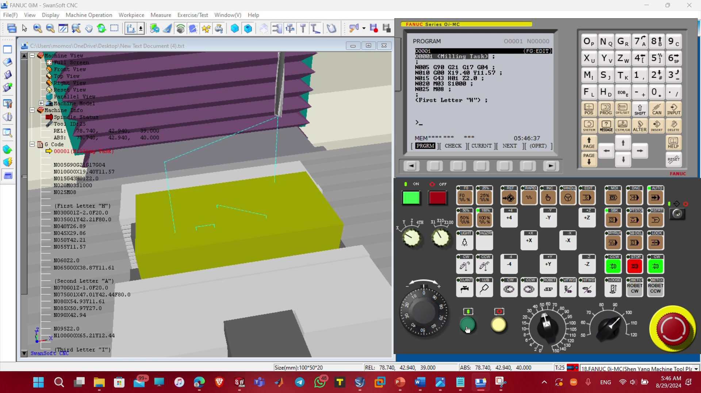

# 🛠️ SwanSoft CNC Turning & Milling Simulation

**Course:** CNC Machines  
**Software:** SwanSoft CNC Simulation  
**Focus:** G-code programming, turning, milling, and virtual CNC machining  

A CNC programming project covering both **turning** and **milling** operations using
**SwanSoft CNC simulation software**.

The project includes four machining exercises:

1. Turning — section exercise
2. Milling — section exercise
3. Turning — lecture task
4. Milling — lecture task

The original report contains the workpiece drawings, G-code, and SwanSoft simulation results.
Two screen recordings of the virtual CNC machining process are also included.

---

## Project Overview

The project demonstrates the complete basic CNC workflow:

```text
Part Drawing
    ↓
Coordinate Planning
    ↓
G-code Programming
    ↓
SwanSoft CNC Setup
    ↓
Virtual Machining
    ↓
Result Verification
```

---

# 1. Turning — Section Exercise

The first turning task creates a stepped cylindrical part using linear turning moves.

<p align="center">
  
</p>

### G-code

[`GCode/turning_section_O0002.nc`](./GCode/turning_section_O0002.nc)

Main operations include:

- metric programming with `G21`
- absolute positioning with `G90`
- XZ turning plane with `G18`
- spindle control
- coolant control
- facing
- stepped external turning

### SwanSoft Result

<p align="center">
  
</p>

---

# 2. Milling — Section Exercise

The milling section performs a rectangular contour operation.

<p align="center">
  
</p>

### G-code

[`GCode/milling_section_O0001.nc`](./GCode/milling_section_O0001.nc)

The tool follows the rectangular profile using X/Y linear interpolation.

### SwanSoft Result

<p align="center">
  
</p>

---

# 3. Turning — Lecture Task

The second turning program extends the stepped-shaft exercise by adding **circular interpolation**
to generate curved transitions.

<p align="center">
  
</p>

### G-code

[`GCode/turning_lecture_O0002.nc`](./GCode/turning_lecture_O0002.nc)

Important commands include:

```text
G01 — linear interpolation
G03 — counterclockwise circular interpolation
M04 — spindle rotation
M08 — coolant ON
M09 — coolant OFF
```

### Simulation Video

[`Videos/SwanSoft_Turning_Simulation.mp4`](./Videos/SwanSoft_Turning_Simulation.mp4)

<p align="center">
  
</p>

---

# 4. Milling — Lecture Task ("HAI")

The final milling task machines the letters:

```text
H A I
```

into the workpiece using programmed X/Y tool paths.

<p align="center">
  
</p>

### G-code

[`GCode/milling_lecture_HAI_O0001.nc`](./GCode/milling_lecture_HAI_O0001.nc)

The program is organized into three sections:

```text
Letter H
Letter A
Letter I
```

Each character is produced using a sequence of linear interpolation moves.

### Simulation Video

[`Videos/SwanSoft_Milling_Simulation.mp4`](./Videos/SwanSoft_Milling_Simulation.mp4)

<p align="center">
  
</p>

---

## G-code Files

```text
GCode/
├── turning_section_O0002.nc
├── milling_section_O0001.nc
├── turning_lecture_O0002.nc
└── milling_lecture_HAI_O0001.nc
```

These `.nc` files were reconstructed from the code printed in the original course report.

---

## CNC Concepts Practiced

- G-code structure
- Metric programming (`G21`)
- Absolute coordinate programming (`G90`)
- Turning plane selection (`G18`)
- Milling plane selection (`G17`)
- Rapid positioning (`G00`)
- Linear interpolation (`G01`)
- Circular interpolation (`G03`)
- Spindle commands
- Feed-rate programming
- Coolant commands
- Tool offsets
- Turning toolpaths
- Milling contour toolpaths
- SwanSoft CNC simulation
- Virtual machining verification

---

## Running the Simulations

The G-code programs can be loaded into **SwanSoft CNC Simulation** using an appropriate
turning or milling machine configuration.

Because CNC controller dialects and machine setups can differ, the reconstructed code should
be treated as **educational simulation code** and verified before use on physical CNC hardware.

---

## Documentation

The original CNC report is preserved here:

[`Docs/CNC_Machines_Projects.pdf`](./Docs/CNC_Machines_Projects.pdf)

It contains the original workpiece drawings, programming exercises, G-code listings,
and SwanSoft screenshots.

---

## Source Reconstruction Note

Only the PDF report and SwanSoft simulation recordings were available.

The `.nc` files in this repository were therefore reconstructed from the G-code displayed
in the report rather than recovered from original CNC program files.

> Educational CNC project demonstrating turning and milling programming through G-code
> development and SwanSoft virtual machining simulation.
